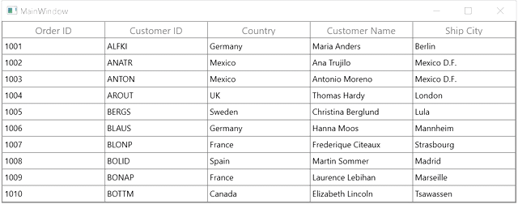

# How Column Accept Unique Value Per Row Using WPF DataGrid?

This sample show cases how to enter the unique value per row in [WPF DataGrid](https://www.syncfusion.com/wpf-controls/datagrid) (SfDataGrid).

You can make a specific column accept unique value per row using [SfDataGrid.CurrentCellValidating](https://help.syncfusion.com/cr/wpf/Syncfusion.UI.Xaml.Grid.SfDataGrid.html#Syncfusion_UI_Xaml_Grid_SfDataGrid_CurrentCellValidating) event in `DataGrid`.

#### XAML
``` xml
<syncfusion:SfDataGrid x:Name="dataGrid"  ItemsSource="{Binding Orders}" 
                       AutoGenerateColumns="False" AllowEditing="True" 
                       CurrentCellValidating="dataGrid_CurrentCellValidating" >
    <syncfusion:SfDataGrid.Columns>
        <syncfusion:GridTextColumn MappingName="OrderID" HeaderText="Order ID" />
        <syncfusion:GridTextColumn MappingName="CustomerID" HeaderText="Customer ID" />
        <syncfusion:GridTextColumn MappingName="Country"/>
        <syncfusion:GridTextColumn MappingName="CustomerName" HeaderText="Customer Name" />
        <syncfusion:GridTextColumn MappingName="ShipCity" HeaderText="Ship City" />
    </syncfusion:SfDataGrid.Columns>
</syncfusion:SfDataGrid>
```

#### C#
```c#
private void dataGrid_CurrentCellValidating(object sender, Syncfusion.UI.Xaml.Grid.CurrentCellValidatingEventArgs e)
{
    if (e.Column.MappingName == "OrderID")
    {
        for (int i = 0; i < dataGrid.View.Records.Count; i++)
        {
            if ((this.dataGrid.View.Records[i].Data as OrderInfo).OrderID.ToString().Equals((e.NewValue.ToString())) && (e.NewValue.ToString() != e.OldValue.ToString()))
            {
                e.IsValid = false;
                e.ErrorMessage = "Invalid Value";
                break;
            }
        }
    }
}
```



## Requirements to run the demo
 Visual Studio 2015 and above versions